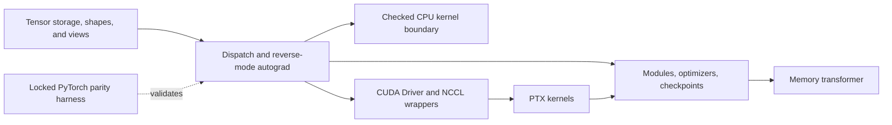

# Heirloom

Heirloom is a Rust ML-systems research framework with tensor storage, reverse-mode autograd, CPU/CUDA kernels, training and checkpoint infrastructure, and an experimental memory transformer.

The repository is intentionally narrower than PyTorch and more candid than a production framework. It demonstrates the contracts that become difficult at the boundary between tensor views, reverse-mode autograd, device dispatch, unsafe kernels, optimizers, checkpointing, and a memory-augmented transformer. It does not claim framework parity, production training performance, or broad hardware portability.

The memory work explores sparse updates and continual learning; an advantage over matched baselines has not been demonstrated. Read the [known correctness limits and evidence scope](docs/known-limitations.md) before using sparse accumulation, changing policy on resume, or relying on decoupled AdamW weight decay.

## Architecture



The primary implementation is the root `heirloom` crate plus `heirloom-kernels`. The Python binding is a parity harness. Padawan, the skill compiler, governed-corpus work, and GCP automation are preserved as experimental or supporting monorepo tracks and are not required to review the core system; see [the monorepo map](docs/MONOREPO_MAP.md).

## Five-minute run

Install `rustup`, clone the repository, and run:

```bash
cargo run --bin train
```

`rust-toolchain.toml` selects Rust 1.95.0. The deterministic regression example should begin and end approximately as follows:

```text
epoch=000 loss=4.446406
...
epoch=219 loss=0.000000
initial_loss=4.446406
final_loss=0.000000
```

For the complete CPU/software review gate:

```bash
./scripts/validate.sh
```

Docker provides the cleanest local approximation of a fresh clone:

```bash
./scripts/docker_validate.sh
```

## What is technically interesting

- Tensor views carry shape, stride, storage-offset, dtype, and device metadata. Autograd preserves alias-sensitive semantics, checks saved-tensor versions, and represents gradients as tensors rather than untyped vectors.
- Matrix dimensions and strides are checked before crossing safe Rust into BLAS-style or CUDA boundaries. Invalid lengths, overflow, and impossible pointer strides return typed errors.
- CUDA is loaded through the Driver API, kernels are explicit PTX assets, and NCCL is dynamically loaded behind a safe wrapper. Runtime counters make kernel-path and fallback claims inspectable.
- The memory transformer uses exact or product-key lookup, selected-row gradient paths, sparse-row optimizer updates, SMFT row masks, checkpoint family metadata, and CPU/CUDA-specific tests, subject to the correctness limits below.
- A thin PyO3 module compares the live Rust runtime with PyTorch using a locked CPU-only Python environment; it is evidence infrastructure, not a second public API.

## Evidence and test lanes

| Lane | Command | What the result means |
| --- | --- | --- |
| CPU/software | `./scripts/test_cpu.sh` | Runs the Rust workspace. CUDA and NCCL integration tests are reported as ignored, not passed. |
| Full local gate | `./scripts/validate.sh` | Adds formatting, pinned-toolchain checks, Clippy `-D warnings`, fixtures, CLI smoke paths, and examples. |
| Python/PyTorch parity | `./scripts/python_parity.sh` | Syncs `uv.lock`, builds the PyO3 extension, and compares against CPU PyTorch. The recorded local result is 7 passed and 1 CUDA-only test skipped; it was not rerun in this documentation pass. |
| CUDA integration | `./scripts/test_gpu.sh cuda` | Runs only explicitly ignored CUDA tests and fails if the Driver API or required BF16 capability is absent. |
| NCCL integration | `./scripts/test_gpu.sh nccl` | Runs the explicitly ignored NCCL test and fails if CUDA/NCCL is unavailable. |
| Dependency audit | `cargo audit` | Checks `Cargo.lock` against RustSec; the CI gate rejects vulnerability advisories. |

The recorded August 8, 2026 validation reports passes on one A100-SXM4-80GB against source revision `74307a195a9bba0ad53117efd160df77801445da`: 61 CUDA tests, one single-rank NCCL all-reduce test, CUDA/Tensor Core smoke checks, both existing microbench sections, and the worker's CPU/Clippy quick gate. The evidence-publication commit changes documentation only, including a rustdoc link. Exact commands, versions, measurements, hashes, and the separately labeled historical 4 × A100 evidence are in [GPU validation evidence](docs/evidence/gpu-validation.md). Its raw artifacts remain private; this documentation pass neither retrieved them nor reran GPU validation.

## Current scope and limitations

- This is a focused prototype, not PyTorch parity. Operator, dtype, device, broadcasting, serialization, and distributed surfaces are deliberately incomplete.
- **Sparse accumulation:** with sparse memory updates and `grad_accumulation_steps > 1`, later forwards overwrite selected rows and can omit earlier microbatch rows from the optimizer step. Treat this combination as unsupported.
- **Resume policy:** memory-model resume retains the checkpoint's update and SMFT policies. Requested CLI policy changes are not applied or explicitly rejected; policy transitions through resume are unsupported.
- **Optimizer decay:** nonzero weight decay enters Adam's moments in the inspected dense/sparse CPU and PTX `AdamW` paths. These paths use coupled decay, so standard decoupled AdamW semantics must not be assumed. [Source details and test boundaries](docs/known-limitations.md) cover all three issues.
- CPU kernels favor legible correctness over allocation-free performance. Some strided operations materialize contiguous data.
- CUDA coverage is opt-in and hardware-specific. Several Tensor Core and flash-attention routes remain guarded experiments; unsupported paths return errors rather than silently staging through CPU.
- The August 8 GPU record is a single-device A100 run; its NCCL result is rank 0 of 1. The retained 4 × A100 evidence is from an older source snapshot. Together they do not prove current-revision multi-GPU behavior, multi-node scaling, tuned end-to-end training throughput, production reliability, or model quality.
- The memory transformer is a systems integration target with bounded training checks. Synthetic `learning_sanity` reports are validator fixtures; the historical 32-block run's training loss increased from about 6.8154 to 7.0453. Neither establishes a continual-learning improvement; see the [evidence distinctions](docs/known-limitations.md#evidence-scope).
- `heirloom_py` exists for parity testing and is not maintained as a general Python package.
- Experimental corpus, cloud, Padawan, and skill/compiler tracks remain in the repository for provenance but are outside the primary review path.

`HARD_MODE.md` records additional non-parity gaps, while [development history](docs/history/README.md) preserves the long work log and milestone evidence without making it the front door.

## Recommended 20-minute review

1. `src/tensor.rs` — storage-backed tensor metadata, checked views, dtype/device movement, and operation entry points.
2. `src/tensor/autograd.rs` — graph construction, saved tensors, gradient accumulation, and backward formulas.
3. `src/dispatch.rs` — device/dtype routing and checked preparation of CPU matrix kernels.
4. `heirloom-kernels/src/lib.rs` — the small safe matrix boundary and its documented unsafe-call invariants.
5. `heirloom-kernels/src/cuda.rs` — dynamic CUDA/NCCL loading, buffer ownership, launch validation, and kernel wrappers; PTX lives beside it as named assets.
6. `src/memory_transformer.rs` — the application layer that exercises modules, autograd, sparse memory updates, and device-specific primitives.

If time remains, inspect `tests/aliasing_invariants.rs`, `tests/cuda_storage.rs`, and `tests/memory_transformer.rs` to see how those contracts are defended.

## Contributing and license

Setup and change expectations are in [CONTRIBUTING.md](CONTRIBUTING.md); all test lanes are described in [TESTING.md](TESTING.md). Heirloom is dual-licensed under [MIT](LICENSE-MIT) or [Apache-2.0](LICENSE-APACHE).
